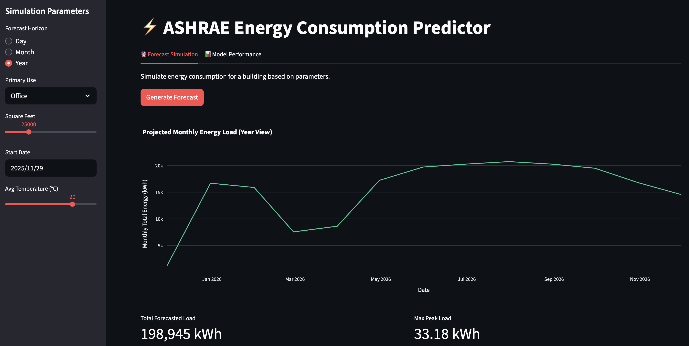
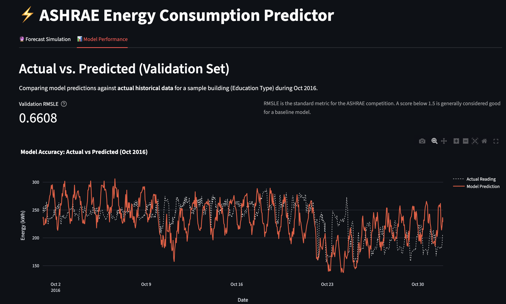

Try the energy forecasting app at https://energyml.streamlit.app

Forecast sample 

Model evaluation 


⚡ ASHRAE Energy Consumption Predictor

An end-to-end Machine Learning project that forecasts energy consumption for commercial buildings based on historical usage, weather patterns, and building metadata. This project demonstrates a full MLOps workflow from raw data ingestion to an interactive deployment.

🎯 Project Goals

The goal was to build a robust regression model to predict the Meter Reading (Energy Usage) for various building types (Education, Office, etc.) to help facility managers optimize energy efficiency, using code assistant. I used Gemini-gemini.google.com

Key Technical Achievements:

MLOps Pipeline: Modularized code for feature engineering and training.

Advanced Feature Engineering: Implemented Cyclical Time Encoding (Sine/Cosine) and Weather Lags to capture thermal inertia.

Robust Validation: Used Time-Series Split (train on Jan-Sep, validate on Oct-Dec) instead of random K-Fold to prevent data leakage.

Interactive Deployment: Built a Streamlit web app allowing users to simulate weather scenarios and forecast loads dynamically.

## 🏗️ Project Structure
```text
05-ENERGYML/
├── app/                  # Streamlit Web Application
│   ├── streamlit_app.py  # Main app entry point
│   └── utils.py          # Inference logic & feature generation
├── src/                  # Core source code (MLOps)
│   ├── features.py       # Custom Scikit-learn Transformers
│   └── models.py         # Model Factory (LGBM, XGBoost, CatBoost)
├── notebooks/            # Jupyter Notebooks for experimentation
│   ├── 01_EDA.ipynb             # Exploratory Data Analysis
│   ├── 02_preprocessing.ipynb   # Feature Pipeline & Memory Optimization
│   └── 03_modeling.ipynb        # Model Training & Validation
├── models/               # Serialized models (.pkl)
├── data/                 # Raw and Processed Data (Not in Git)
├── scripts/              # Helper scripts
│   └── generate_val_data.py
└── requirements.txt      # Python dependencies
```

⚙️ Installation & Usage

1. Setup Environment

# Clone the repository
git clone [https://github.com/tonybaby16/05-energyML.git](https://github.com/tonybaby16/05-energyML.git)
cd 05-energyML

# Create virtual environment
python -m venv .venv
source .venv/bin/activate  # On Windows: .venv\Scripts\activate

# Install dependencies
pip install -r requirements.txt


2. Data Preparation

The dataset is from the ASHRAE - Great Energy Predictor III competition.

Download train.csv, weather_train.csv, and building_metadata.csv from Kaggle.

Place them in data/raw/.

Run the preprocessing pipeline:

Run notebooks/02_preprocessing.ipynb to clean data and generate features.

3. Model Training

Train the model using the optimized LightGBM parameters:

Run notebooks/03_modeling.ipynb.

This will save the best model to models/best_energy_model.pkl.

4. Run the App

Launch the interactive dashboard locally:

streamlit run app/streamlit_app.py


📊 Methodology & Features

1. Feature Engineering

We moved beyond simple raw features to capture physical realities:

Cyclical Time: Converted Hour and Month into Sin and Cos components. This allows the model to understand that Hour 23 is close to Hour 0.

Weather Lags: Calculated rolling averages (3h, 24h) of temperature. Buildings have "thermal mass"—they don't cool down instantly when the sun sets.

Log-Transformation: The target variable (Energy) was log-transformed (log1p) to handle the skewed distribution and reduce the impact of outliers.

2. Model Performance

We compared multiple algorithms. LightGBM was selected as the champion model due to its superior speed and accuracy on tabular data.

Metric

Score (Validation)

RMSLE

~0.66

Training Time

< 5 mins

(Note: RMSLE stands for Root Mean Squared Logarithmic Error)

🔮 Future Improvements

Hyperparameter Tuning: Implement Optuna for automated Bayesian optimization.

Ensembling: Stack XGBoost and CatBoost predictions for marginal gains.

Containerization: Dockerize the application for cloud deployment (AWS/Azure).

📄 License

This project is open-source under the MIT License.
